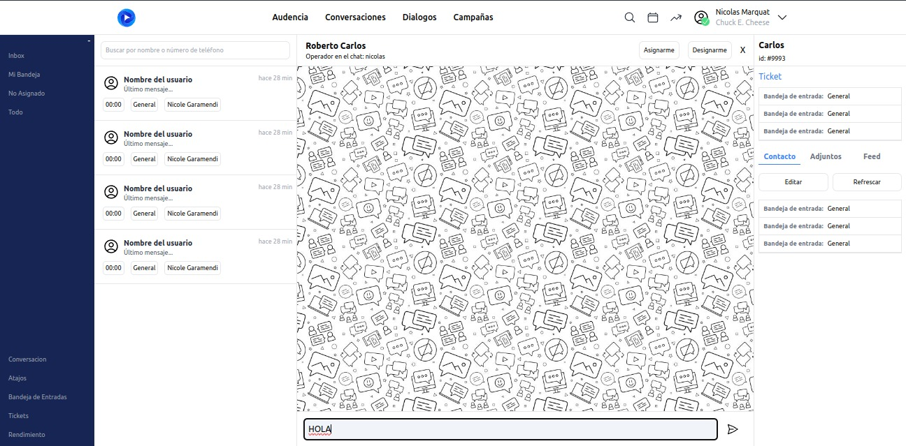
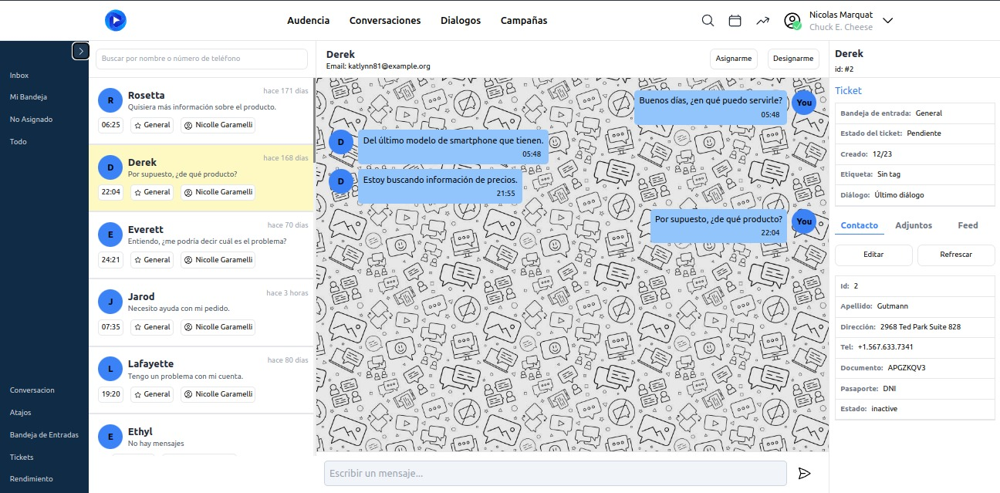

# Guía de Configuración y Ejecución del Proyecto

## Introducción

Este README proporciona una visión general de la estructura del proyecto e instrucciones sobre cómo configurar y ejecutar la aplicación.

## Estructura del Proyecto

- `src/`: Contiene el código fuente de la aplicación, incluyendo componentes Vue y recursos.
  - `assets/`: Almacena archivos estáticos como hojas de estilo (main.css con Tailwind CSS).
  - `components/`: Componentes Vue utilizados en toda la aplicación.
    - `header/`: Componentes relacionados con la cabecera de la aplicación, como `NavBar.vue`.
  - `views/`: Las diferentes vistas de la aplicación, cada una representada por un componente Vue.
  - `router/`: Configuración de Vue Router para la navegación entre vistas.
  - `store/`: Estado centralizado de la aplicación gestionado por Vuex.
  - `utils/`: Funciones de utilidad y helpers que se pueden reutilizar en diferentes partes del proyecto.
- `public/`: Activos públicos como el index.html y favicon.
- `public/`: Activos públicos como el index.html y favicon.

## Instrucciones de Configuración

Para configurar y ejecutar la aplicación localmente, sigue estos pasos paso por paso:

1. Clona el repositorio utilizando el comando:
   ```
   git clone https://github.com/GonzaloArray/chat-ch-test.git
   ```
2. Navega al directorio del proyecto en tu terminal con `cd chat-ch-test`.
3. Instala las dependencias del proyecto con `npm install`.
4. Ejecuta la aplicación en modo de desarrollo con `npm run dev`.
5. Abre tu navegador y visita `http://localhost:3000` para ver la aplicación en funcionamiento.


## Progreso del Proyecto

A continuación, se presentan imágenes que muestran el avance del proyecto en sus diferentes etapas:

1. Diseño inicial de la interfaz de usuario:
   
2. Implementación de la funcionalidad de chat:
   
3. Versión final del producto:
   

