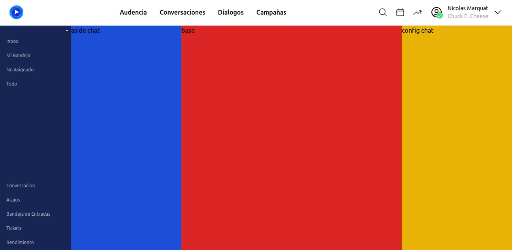

# Guía de Configuración y Ejecución del Proyecto

## Introducción

Este README proporciona una visión general de la estructura del proyecto e instrucciones sobre cómo configurar y ejecutar la aplicación.

## Estructura del Proyecto

- `src/`: Contiene el código fuente de la aplicación, incluyendo componentes Vue y recursos.
  - `assets/`: Almacena archivos estáticos como hojas de estilo (main.css con Tailwind CSS).
  - `components/`: Componentes Vue utilizados en toda la aplicación.
    - `header/`: Componentes relacionados con la cabecera de la aplicación, como `NavBar.vue`.
  - `views/`: Las diferentes vistas de la aplicación, cada una representada por un componente Vue.
  - `router/`: Configuración de Vue Router para la navegación entre vistas.
  - `store/`: Estado centralizado de la aplicación gestionado por Vuex.
  - `utils/`: Funciones de utilidad y helpers que se pueden reutilizar en diferentes partes del proyecto.
- `public/`: Activos públicos como el index.html y favicon.
- `public/`: Activos públicos como el index.html y favicon.

## Instrucciones de Configuración

Para configurar y ejecutar la aplicación localmente, sigue estos pasos paso por paso:

1. Clona el repositorio utilizando el comando:
   ```
   git clone https://github.com/GonzaloArray/chat-ch-test.git
   ```
2. Navega al directorio del proyecto en tu terminal con `cd chat-ch-test`.
3. Instala las dependencias del proyecto con `npm install`.
4. Ejecuta la aplicación en modo de desarrollo con `npm run dev`.
5. Abre tu navegador y visita `http://localhost:3000` para ver la aplicación en funcionamiento.


## Progreso del Proyecto

A continuación, se presentan imágenes que muestran el avance del proyecto en sus diferentes etapas:

1. Diseño inicial de la interfaz de usuario:
   
2. Explicación de la funcionalidad de chat:
   La implementación del chat permite a los usuarios comunicarse en tiempo real, intercambiando mensajes de manera fluida y dinámica.
   
3. Versión final del producto:
   


## Mejoras Futuras para el Chat

Una mejora significativa para la experiencia de usuario en el chat sería implementar una funcionalidad que permita que los mensajes recién llegados se muestren al principio de la conversación. Esto facilitaría a los usuarios ver los mensajes más recientes sin necesidad de desplazarse a través de todo el historial de chat. La implementación de esta característica podría incluir un sistema de ordenamiento que priorice los mensajes nuevos o un botón para desplazarse rápidamente al último mensaje recibido.


### Mejoras de Interfaz

Para mejorar la experiencia de usuario en la interfaz del chat, se considerarán las siguientes mejoras:

- **Modo Oscuro**: Implementación de un modo oscuro para reducir la fatiga visual durante el uso nocturno o en entornos con poca luz.
- **Personalización de Temas**: Permitir a los usuarios personalizar los colores y temas del chat para una experiencia más personal.
- **Notificaciones de Mensajes**: Mejorar el sistema de notificaciones para informar a los usuarios de nuevos mensajes de manera más efectiva.
- **Emojis y Gifs**: Integrar un selector de emojis y gifs para enriquecer la comunicación y hacerla más expresiva.
- **Respuestas Directas**: Añadir la posibilidad de responder a mensajes específicos para facilitar el seguimiento de conversaciones.
- **Vista de Conversaciones Ancladas**: Permitir a los usuarios anclar conversaciones importantes en la parte superior de la lista de chats.


